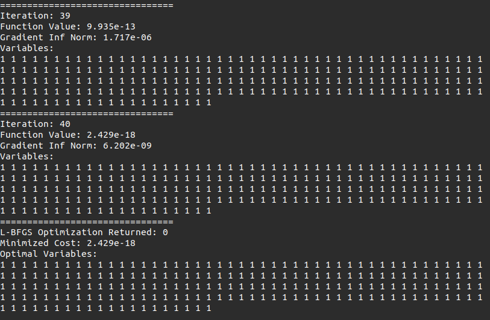
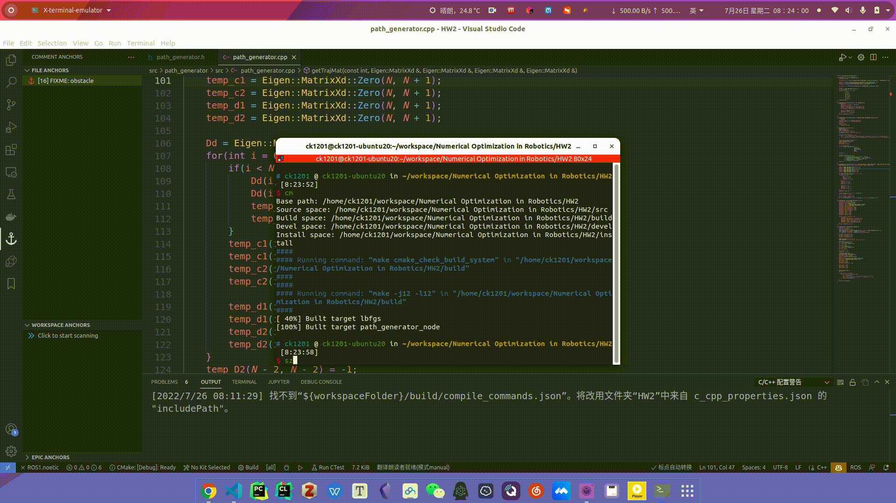

# HW2_1 LBFGS-example

## Lewis & Overton line search

## 结果

# HW2_2 Smooth Navigation Path Generation

## 建模

对于经过 $N+1$ 个给定点 $x_{0}, x_{1}, \ldots, x_{N}$ 的 $N$ 段轨迹 $p_{i}(s),i=0,\cdots,N$ ，每段轨迹都是一个三次样条曲线
$$
p_{i}(s)=a_{i}+b_{i} s+c_{i} s^{2}+d_{i} s^{3}, s \in[0,1],i=0,\cdots,N-1
$$
根据轨迹之间的一阶和二阶连续以及边界条件可得
$$
\begin{aligned}
&a_{i}=x_{i} \\
&b_{i}=D_{i} \\
&c_{i}=3\left(x_{i+1}-x_{i}\right)-2 D_{i}-D_{i+1} \\
&d_{i}=2\left(x_{i}-x_{i+1}\right)+D_{i}+D_{i+1}
\end{aligned},i=0,\cdots,N-1
$$
令 $\mathbf{x}=[x_0,x_1,\cdots,x_{N-1},x_{N}]^{T}$ ，则
$$
\mathbf{a}=
\left[\begin{array}{c}
a_{0} \\
\vdots \\
a_{N-1}
\end{array}\right]
=
\left[\begin{array}{ccccccc}
1 & & & & \\
 & 1 & & & \\
& & \ddots & & \\
& & & 1 & & \\
& & & & 1 & 0
\end{array}\right]_{N\times N+1}
\mathbf{x}
$$

$$
\mathbf{b}=
\left[\begin{array}{c}
b_{0} \\
\vdots \\
b_{N-1}
\end{array}\right]
=
\left[\begin{array}{ccccccc}
1 & & & & \\
 & 1 & & & \\
& & \ddots & & \\
& & & 1 & & \\
& & & & 1 & 0
\end{array}\right]_{N\times N+1}
\mathbf{D}
$$

$$
\mathbf{D}=
\left[\begin{array}{c}
D_{0} \\
\vdots \\
D_{N}
\end{array}\right]
=\mathbf{A}_D\mathbf{x}
$$
其中，
$$
\mathbf{A}_D=3\left[\begin{array}{c}
\mathbf{0} \\
\mathbf{D}_D \\
\mathbf{0}
\end{array}\right]_{N+1\times N-1}
\left[\begin{array}{ccccccc}
-1 & 0 & 1 & & & & \\
 & -1 & 0 & 1 & & & \\
& & \ddots & \ddots & \ddots & & \\
& & & -1 & 0 & 1 & \\
& & & & -1 & 0 & 1
\end{array}\right]_{N-1\times N+1}
$$

$$
\mathbf{D}_D=\left[\begin{array}{ccccccc}
4 & 1 & & & & & \\
1 & 4 & 1 & & & & \\
& 1 & 4 & 1 & & & \\
& & 1 & 4 & 1 & & \\
& & & \ddots & \ddots & \ddots & \\
& & & & 1 & 4 & 1 \\
& & & & & 1 & 4
\end{array}\right]^{-1}_{N-1\times N-1}
$$

对于系数 $\mathbf{c}$ ，
$$
\mathbf{c}=\left[\begin{array}{c}
c_{0} \\
\vdots \\
c_{N-1}
\end{array}\right]=
\mathbf{A}_c
\mathbf{x}
$$
其中，
$$
\mathbf{A}_c=
3
\left[\begin{array}{ccccccc}
-1 & 1 & & & & \\
& -1 & 1 & & & \\
& & \ddots & \ddots & & \\
& & & -1 & 1 & \\
& & & & -1 & 1
\end{array}\right]_{N\times N+1}
+
\left[\begin{array}{ccccccc}
-2 & -1 & & & & \\
& -2 & -1 & & & \\
& & \ddots & \ddots & & \\
& & & -2 & -1 & \\
& & & & -2 & -1
\end{array}\right]_{N\times N+1}\mathbf{A}_D
$$
对于系数 $\mathbf{d}$ ，
$$
\mathbf{d}=\left[\begin{array}{c}
d_{0} \\
\vdots \\
d_{N-1}
\end{array}\right]=
\mathbf{A}_d\mathbf{x}
$$
其中，
$$
\mathbf{A}_d=
2
\left[\begin{array}{ccccccc}
1 & -1 & & & & \\
& 1 & -1 & & & \\
& & \ddots & \ddots & & \\
& & & 1 & -1 & \\
& & & & 1 & -1
\end{array}\right]_{N\times N+1}+
\left[\begin{array}{ccccccc}
1 & 1 & & & & \\
& 1 & 1 & & & \\
& & \ddots & \ddots & & \\
& & & 1 & 1 & \\
& & & & 1 & 1
\end{array}\right]_{N\times N+1}\mathbf{A}_D
$$

### Stretch Energy

$$
\operatorname{Energy}\left(x_{1}, x_{2}, \ldots, x_{N-1}\right)=\sum_{i=0}^{N-1} \int_{0}^{1}\left\|p_{i}^{(2)}(s)\right\|^{2} \mathrm{~d} s
$$

其中

$p_{i}^{(2)}(s)=2c_i+6d_is$

$\left\|p_{i}^{(2)}(s)\right\|=4c_{i}^2+24c_{i}d_{i}s+36d_{i}^2s^2$

$E_	i=\int_{0}^{1}\left\|p_{i}^{(2)}(s)\right\|^{2} \mathrm{~d} s=4c_{i}^2+12c_{i}d_{i}+12d_{i}^2$

则
$$
\mathbf{E}=4\mathbf{c}^T\mathbf{c}+12(\mathbf{c}^T\mathbf{d}+\mathbf{d}^T\mathbf{d})
=\mathbf{x}^T(4\mathbf{A}_c^T\mathbf{A}_c+12\mathbf{A}_c^T\mathbf{A}_d+12\mathbf{A}_d^T\mathbf{A}_d)\mathbf{x}
=\mathbf{x}^T\mathbf{A}_E\mathbf{x}
$$
梯度
$$
\frac{\partial \mathbf{E}}{\partial \mathbf{x}}=(\mathbf{A}_E+\mathbf{A}_E^T)\mathbf{x}
$$

对于二维的情况，令 $\mathbf{x}=[x_0,\cdots,x_{N},y_0,\cdots,y_{N}]^{T}_{\ 2(N+1)\times1}$ ，则
$$
\mathbf{E}=\mathbf{x}^T\mathbf{A}_E^{'}\mathbf{x}=\mathbf{x}^T\left[\begin{array}{ccccccc}
\mathbf{A}_E & \\
& \mathbf{A}_E \\
\end{array}\right]_{2(N+1)\times 2(N+1)}\mathbf{x}
$$

$$
\frac{\partial \mathbf{E}}{\partial \mathbf{x}}=\left[\begin{array}{ccccccc}
\mathbf{A}_E+\mathbf{A}_E^T & \\
& \mathbf{A}_E+\mathbf{A}_E^T \\
\end{array}\right]_{2(N+1)\times 2(N+1)}\mathbf{x}
$$

### Potential

$$
\operatorname{Potential}\left(x_{1}, x_{2} \ldots, x_{N-1}\right)=1000 \sum_{i=1}^{N-1} \sum_{j=1}^{M} \max \left(r_{j}-\left\|x_{i}-o_{j}\right\|, 0\right)
$$

$$
\frac{\partial P}{\partial x}=
1000\left[\begin{array}{c}
\sum_{j=1}^{M}g_{1,j} \\
\vdots \\
\sum_{j=1}^{M}g_{N-1,j}
\end{array}\right]
$$

其中
$$
g_{i,j}= \begin{cases}-\frac{x_i-o_j}{\left\|x_{i}-o_{j}\right\|} & ,\text { if } r_{j}-\left\|x_{i}-o_{j}\right\|>0 \\ 0 & ,\text { otherwise }\end{cases}
$$

## 结果

演示视频见attachments文件夹中的 HW2_example.mp4 。

成功规划出一条无碰撞的最小拉伸能量轨迹。

