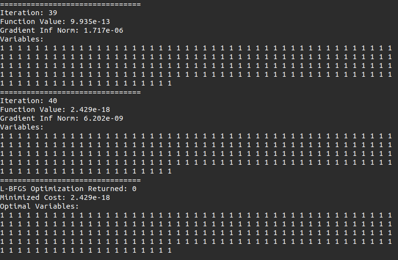
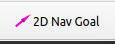
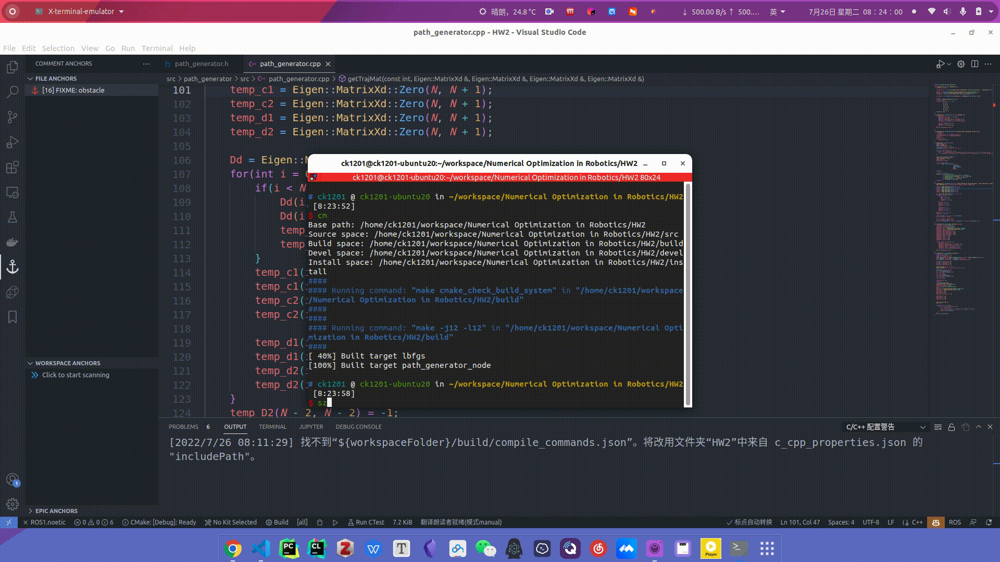

# Quick Start

## HW2_1

```
catkin_make -DCMAKE_BUILD_TYPE=Release -DCMAKE_EXPORT_COMPILE_COMMANDS=Yes
./build/lbfgs/lbfgs
```

Then you will see the Function Value, Gradient Inf Norm and Variables of every iteration on your terminal.



## HW2_2

```
catkin_make -DCMAKE_BUILD_TYPE=Release -DCMAKE_EXPORT_COMPILE_COMMANDS=Yes
source ./devel/setup.zsh
roslaunch path_generator run_example.launch
```

use rviz plugin  to select start and goal points.

