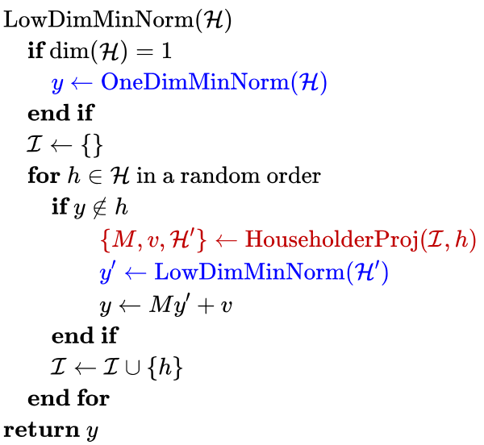
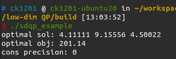
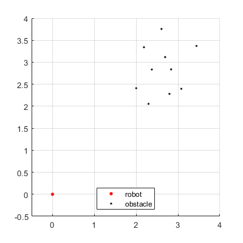
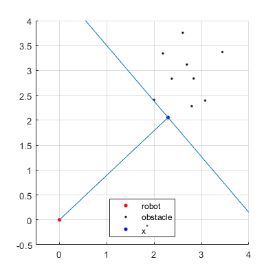
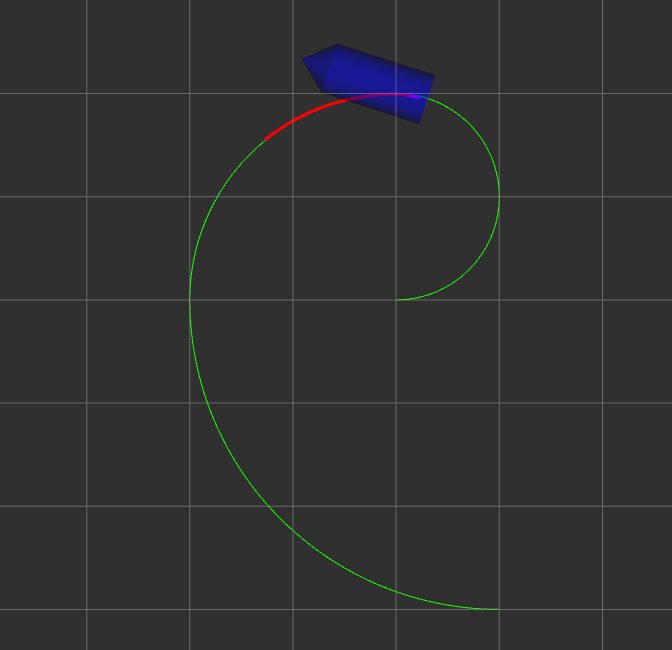
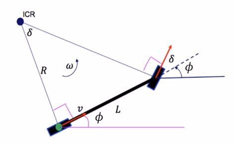
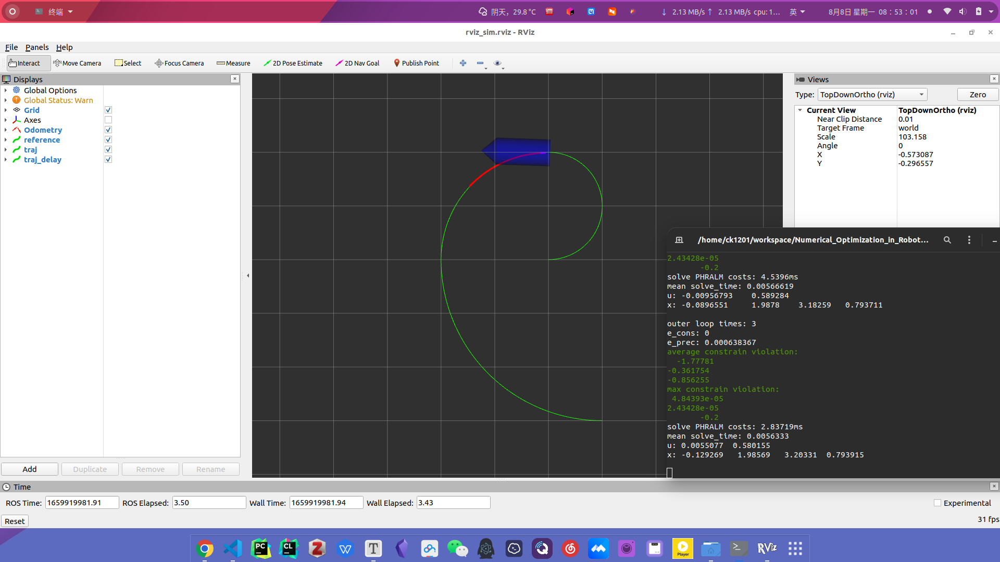

# HW3

## HW3_1 KKT

$$
\begin{array}{l}
\underset{x \in \mathbb{R}^{n}}{\min} \frac{1}{2} x^{T} Q x+c^{T} x \\
\text { s.t. } A x=b
\end{array}
$$

**stationarity**

if $Q=Q^T$ , then
$$
\begin{aligned}
\frac{\partial}{\partial x}(\frac{1}{2} x^{T} Q x+c^{T} x+v^T(Ax-b))|_{x=x^*} =&0\\
Qx^*+A^Tv^*=&-c
\end{aligned}
$$
**primal feasibility**
$$
A x^*=b
$$
**KKT condition**
$$
\left[\begin{array}{cc}
Q & A^{T} \\
A & 0
\end{array}\right]\left[\begin{array}{l}
x^{*} \\
v^{*}
\end{array}\right]=\left[\begin{array}{c}
-c \\
b
\end{array}\right]
$$

### 例

$$
\begin{array}{l}
\underset{x \in \mathbb{R}^{n}}{\min} \frac{1}{2} x^{T} 
\left[\begin{array}{cc}
1 & 2 \\
3 & 4
\end{array}\right]
x+\left[\begin{array}{cc}
5 \\
6
\end{array}\right]^{T} x \\
\text { s.t. } 
\left[\begin{array}{cc}
7 & 8
\end{array}\right]
x=9
\end{array}
$$

则
$$
\left[\begin{array}{l}
x^{*} \\
v^{*}
\end{array}\right]=\left[\begin{array}{cc}
1 & 2 & 7\\
3 & 4 & 8\\
7 & 8 & 0
\end{array}\right]^{-1}
\left[\begin{array}{c}
-5 \\
-6 \\
9
\end{array}\right]=
\left[\begin{array}{c}
-6.2 \\
6.55 \\
-1.7
\end{array}\right]
$$

$$
f_{min}=11.8
$$

且 $x^{*}$ 满足等式约束。

## HW3_2 Low-Dimensional QP

### Householder reflection

对于违反当前最优解的 $d$ 维新约束 $g^Ty\leq f$ ，要将之前的约束 $h_i$ 都投影到新约束的边界 $：h:g^Ty=f$ 上，就要找到 $h$ 上的一组 $d-1$ 维标准正交基，可以使用 Householder reflection 得到这组标准正交基。

首先将 $d$ 维单位向量 $I_d$ 的第 $i$ 个元素乘以 $-\operatorname{sgn}\left(g_{i}\right)\|g\|$ ，其中 $i=\operatorname{argmax}_{k}\left|g_{k}\right|$ ，只要将 $I_d$ 通过标准正交变换 $H^{-1}$ ，将 $-\operatorname{sgn}\left(g_{i}\right)\|g\|e_i$ 变换为 $g$ ，则 $I_d$ 中剩余的单位向量则为 $h$ 上的一组 $d-1$ 维标准正交基。

令
$$
u=g+\operatorname{sgn}\left(g_{i}\right)\|g\| e_{i}
$$
则
$$
g-2g^T\frac{u}{\|u\|}\frac{u}{\|u\|}=-\operatorname{sgn}\left(g_{i}\right)\|g\|e_i
$$
整理可得
$$
Hg=-\operatorname{sgn}\left(g_{i}\right)\|g\|e_i
$$
其中
$$
H=I_d-\frac{2uu^T}{u^Tu}
$$
则新约束为
$$
\begin{aligned}
h'&=Hh \\
&=h+(-\frac{2}{u^Tu} u^Th)u
\end{aligned}
$$

$$
f'=f+v^Th
$$

#### 结果

### Collision Distance Compute

对于最小障碍物距离的计算,可以通过求解以下优化问题得到,其中, $v_i,i=1,\cdots,m$ 为 m 个障碍物点云的坐标, $x_{robot}$ 为机器人坐标
$$
\begin{aligned}
&\min _{z \in \mathbb{R}^{d}} z^{\mathrm{T}} z \\
&\text { s.t. }\left(v_{i}-x_{\text {robot }}\right)^{\mathrm{T}} z \geq 1, \forall i \in\{1, \ldots, m\}
\end{aligned}
$$
最终得到离机器人最近的障碍物点为 $x=y+x_{\text {robot }}=z /\left(z^{\mathrm{T}} z\right)+x_{\text {robot }}$ 

#### 结果

机器人和障碍物点云信息如图所示

使用 SDQP 优化得到 $x^*=\left[\begin{array}{cc}
2.29351 \\
2.05478
\end{array}\right]$ ，最短距离为 3.07933，结果如下图所示。

## HW3_3 NMPC

### Run the solveNMPC example

### Use PHR-ALM to replace the Penalty Method in solveNMPC

#### 建模

$$
\begin{array}{cl}
\underset{s_{1}, \ldots, s_{N}, u_{0}, \ldots, u_{N}}{\min} & J\left(s_{1}, \ldots, s_{N}, u_{0}, \ldots, u_{N}\right) \\
\text { s.t. } & F\left(s_{k}, u_{k}\right)=s_{k+1}, \forall i \in\{0, \ldots, N\} \\
& G\left(s_{k}, u_{k}\right) \leq 0, \quad \forall i \in\{0, \ldots, N\}
\end{array}
$$
其中， $s_k=[x_k,y_k,\phi_k,v_k]^T$ 为状态变量， $u_k=[a_k,\delta_k]^T$ 为输入变量， $F\left(s_{k}, u_{k}\right)=s_{k+1}$ 为系统方程

$$
\left\{\begin{array}{l}
\dot{x}=v \cos (\phi) \\
\dot{y}=v \sin (\phi) \\
\dot{\phi}=v \tan (\delta) / L \\
\dot{v}=a
\end{array}\right.
$$
$G\left(s_{k}, u_{k}\right) \leq 0$ 为状态和输入约束
$$
\begin{aligned}
&\forall k \in\{0, \ldots, N\} \\
&a_{\min } \leq a_{k} \leq a_{\max } \\
&\delta_{\min } \leq \delta_{k} \leq \delta_{\max } \\
&v_{\min } \leq v_{k} \leq v_{\max }
\end{aligned}
$$
目标函数为
$$
J\left(s_{1}, \ldots, s_{N}, u_{0}, \ldots, u_{N}\right):=\sum_{k=1}^{N}\left[\left(x_{k}-x_{k}^{\mathrm{ref}}\right)^{2}+\left(y_{k}-y_{k}^{\mathrm{ref}}\right)^{2}+w_{v}\left(a_{k}-a_{k-1}\right)^{2}+w_{\delta}\left(\delta_{k}-\delta_{k-1}\right)^{2}\right]
$$
进一步，消除模型中的系统方程等式约束，将目标函数和不等式约束转化为只与 $u_{0: N}$ 有关的函数
$$
\begin{aligned}
&\min _{u_{0: N}} J\left(s_{1}\left(u_{0: N}\right), \ldots, s_{N}\left(u_{0: N}\right), u_{0: N}\right) \\
&\text { s.t. } G\left(s_{k}\left(u_{0: N}\right), u_{k}\right) \leq 0, \forall i \in\{0, \ldots, N\}
\end{aligned}
$$
引入辅助变量 $s$ ，使得
$$
G\left(s_{k}\left(u_{0: N}\right), u_{k}\right) + [s]^2 = 0
$$
由 PHR-ALM 可得 Lagrangian 函数为
$$
\mathcal{L}_{\rho}(u_{0: N}, \mu):=J\left(s_{1}\left(u_{0: N}\right), \ldots, s_{N}\left(u_{0: N}\right), u_{0: N}\right)+\frac{\rho}{2}\left\|\max \left[G\left(s_{k}\left(u_{0: N}\right), u_{k}\right)+\frac{\mu}{\rho}, 0\right]\right\|^{2}
$$
则
$$
\left\{\begin{array}{l}
u_{0: N} \leftarrow \underset{u_{0: N}}{argmin}\ \mathcal{L}_{\rho}(u_{0: N}, \mu) \\
\mu \leftarrow \max [\mu+\rho G\left(s_{k}\left(u_{0: N}\right), u_{k}\right), 0] \\
\rho \leftarrow \min [(1+\gamma) \rho, \beta]
\end{array}\right.
$$
使用 LBFGS 求解 $u_{0: N} \leftarrow \underset{u_{0: N}}{argmin}\ \mathcal{L}_{\rho}(u_{0: N}, \mu)$ 。

$$
\frac{d}{du}(\frac{\rho}{2}\left\|\max \left[G\left(s_{k}\left(u_{0: N}\right), u_{k}\right)+\frac{\mu}{\rho}, 0\right]\right\|^{2})=\begin{cases}
\rho (G+\frac{\mu}{\rho})\frac{dG}{du} & ,\text { if } G\left(s_{k}\left(u_{0: N}\right),
u_{k}\right)+\frac{\mu}{\rho}>0 \\ 0 & ,\text { otherwise }\end{cases}
$$

设置系数如下表所示

|       系数        |    值     |       系数        |    值     |
| :---------------: | :-------: | :---------------: | :-------: |
|   $\rho_{init}$   |     1     | $\lambda_{init}$  |     0     |
|   $\mu_{init}$    |     0     |     $\gamma$      |     1     |
|      $\beta$      | $10^{3}$  |       $\xi$       |    0.1    |
| $\epsilon_{cons}$ | $10^{-5}$ | $\epsilon_{prec}$ | $10^{-3}$ |

#### 结果

演示视频见./attachments/HW3_3_example.mp4

### Compare the constrain violation in Penalty Method and PHR-ALM

记录下分别使用 Penalty Method 和 PHR-ALM 时，约束 $G\left(s_{k}\left(u_{0: N}\right), u_{k}\right)$ 在整个轨迹跟踪阶段的平均值和最大值以及求解时间，结果如下表所示

|                          | Penalty Average | Penalty Max | PHR-ALM Average | PHR-ALM Max  |
| :----------------------: | :-------------: | :---------: | :-------------: | :----------: |
|    加速度 $a(m/s^2)$     |    -1.57412     | 0.00193741  |    -1.64372     | 8.86053e-05  |
| 前轮转角 $\delta(rad/s)$ |    -0.702643    | 0.00138958  |    -0.681276    | 2.43428e-05  |
|      速度 $v(m/s)$       |    -0.726147    | 0.000512305 |    -0.745466    | -6.41998e-05 |

从结果可知，从平均值上看，两种方法都能使约束得到满足，且数值较接近。从最大值上看， Penalty Method 的违背程度在 $10^{-3}$ 量级，而 PHR-ALM 的违背程度在 $10^{-5}$ 量级。所以， PHR-ALM 在约束违背上比 Penalty Method 更好。在求解时间上， Penalty Method 的平均求解时间为 $6.07996ms$， PHR-ALM为 $3.89999ms$，同样是 PHR-ALM 更好。

