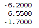
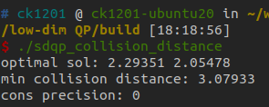
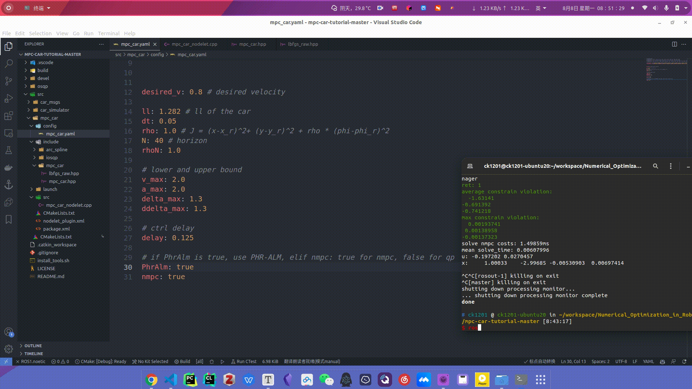

# Quick Start

## HW3_1

run HW3_1.m

Then you will see the optimal sol $\left[\begin{array}{l}
x^{*} \\
v^{*}
\end{array}\right]$ on your terminal.



## HW3_2

### SDQP

```
cd low-dim QP
mkdir build
cd build
cmake ..
make
./sdqp_example
```

Then you will see the optimal sol, optimal obj and cons precision on your terminal.


### Collision Distance Compute

```
cd low-dim QP
mkdir build
cd build
cmake ..
make
./sdqp_collision_distance
```

Then you will see the optimal sol, min collision distance and cons precision on your terminal.



## HW3_3

### How to Tune Parameters

```
./src/mpc_car/config/mpc_car.yaml
set PhrAlm to true
```

### run

```
cd mpc-car-tutorial-master
catkin_make -DCMAKE_BUILD_TYPE=Release -DCMAKE_EXPORT_COMPILE_COMMANDS=Yes
source ./devel/setup.zsh
roslaunch mpc_car simulation.launch
```

