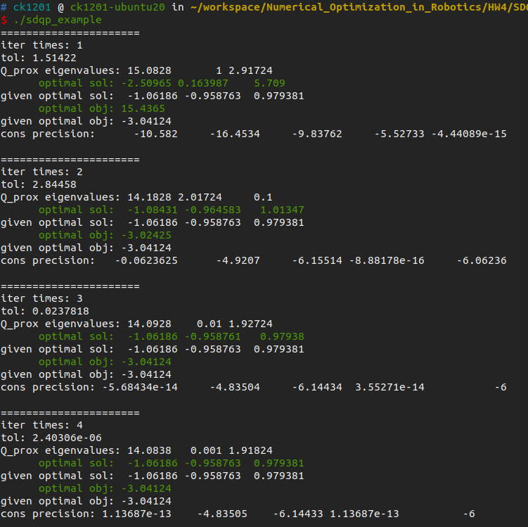
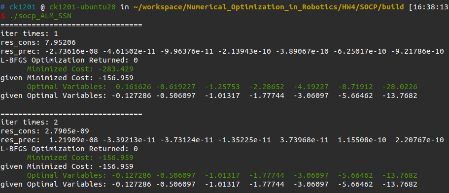

# HW4 Conic Programming

## HW4_1

**Theorem1**：已知 $\xi(x)\in[0,+\infty)$ 为凸 w.r.t x，那么 $\xi^2(x)$ 也为凸。

**Proof**：因为 $\xi(x)$ 为凸，则 $\forall x_1\neq x_2\in\mathbb{R}^1$ 有
$$
\xi(\frac{x_1+x_2}{2})\leq \frac{\xi(x_1)+\xi(x_2)}{2}\tag{1}
$$
又 $\xi(x)\in[0,+\infty)$ ，对不等式两边取平方可得
$$
\xi^2(\frac{x_1+x_2}{2})\leq \frac{\xi^2(x_1)+2\xi(x_1)\xi(x_2)+\xi^2(x_2)}{4}\tag{2}
$$
又
$$
\begin{aligned}
&\frac{\xi^2(x_1)+2\xi(x_1)\xi(x_2)+\xi^2(x_2)}{4}-\frac{\xi^2(x_1)+\xi^2(x_2)}{2}\\
&=-\frac{\xi^2(x_1)-2\xi(x_1)\xi(x_2)+\xi^2(x_2)}{4}\\
&=-\frac{(\xi(x_1)-\xi(x_2))^2}{4}\\
&\leq0
\end{aligned}\tag{3}
$$
由(2)和(3)可得
$$
\xi^2(\frac{x_1+x_2}{2})\leq\frac{\xi^2(x_1)+\xi^2(x_2)}{2}
$$
所以 $\xi^2(x)$ 也为关于 x 的凸函数。证毕。

已知凸问题
$$
\begin{array}{cl}
\min & f(x) \\
\text { s.t. } & g(x) \leq 0 \\
& h(x)=0
\end{array}
$$

即 $f(x),g(x),h(x)$ 均为 x 的凸函数，又Positive weighted sum, point-wise max和对非负函数值的平方操作能够保持原函数的凸性，所以 PHR 增广拉格朗日函数
$$
\mathcal{L}_{\rho}(x, \lambda, \mu):=f(x)+\frac{\rho}{2}\left\{\left\|h(x)+\frac{\lambda}{\rho}\right\|^{2}+\left\|\max \left[g(x)+\frac{\mu}{\rho}, 0\right]\right\|^{2}\right\}
$$
为关于 x 的凸函数。

## HW4_2

对于 low-dimensional QP 问题
$$
\begin{aligned}
&\min _{x \in \mathbb{R}^{n}} \frac{1}{2} x^{\mathrm{T}} M_{\mathcal{Q}} x+c_{\mathcal{Q}}^{\mathrm{T}} x, \\
&\text { s.t. } A_{\mathcal{Q}} x \leq b_{\mathcal{Q}}
\end{aligned}
$$
$M_{\mathcal{Q}} \succeq 0$ 对称半正定。为了使问题能够使用 SDQP 进行求解，即使 $M_{\mathcal{Q}}$ 近似为一个对称正定矩阵。对于正定性，引入变量 $x$ 的先验 $\overline{x}$ 使目标函数近似为

$$
\begin{aligned}
&\frac{1}{2} x^{\mathrm{T}} M_{\mathcal{Q}} x+c_{\mathcal{Q}}^{\mathrm{T}} x+\frac{1}{2\rho}\|x-\overline{x}\|^2\\
&=\frac{1}{2} x^{\mathrm{T}} M_{\mathcal{Q}} x+c_{\mathcal{Q}}^{\mathrm{T}} x+\frac{1}{2\rho}(x-\overline{x})^T(x-\overline{x})\\
&=\frac{1}{2} x^{\mathrm{T}} M_{\mathcal{Q}} x+c_{\mathcal{Q}}^{\mathrm{T}} x+\frac{1}{2\rho}(x^Tx-2\overline{x}^Tx+\overline{x}^T\overline{x})\\
&=\frac{1}{2} x^{T} (M_{\mathcal{Q}}+\frac{1}{\rho}I) x+(c_{\mathcal{Q}}-\frac{1}{\rho}\overline{x})^{T} x+\frac{1}{2\rho}\overline{x}^T\overline{x}
\end{aligned}
$$
当 $\rho\rightarrow+\infty$ ，近似目标函数与原目标函数等价。可知 $M_{\mathcal{Q}}+\frac{1}{\rho}I \succ 0$ 。则近似问题为
$$
\begin{aligned}
&\min _{x \in \mathbb{R}^{n}} \frac{1}{2} x^{T} (M_{\mathcal{Q}}+\frac{1}{\rho}I) x+(c_{\mathcal{Q}}-\frac{1}{\rho}\overline{x})^{T} x, \\
&\text { s.t. } A_{\mathcal{Q}} x \leq b_{\mathcal{Q}}
\end{aligned}\tag{4}
$$
通过反复求解问题(4)，并在每次求解前令 $\overline{x}=x^*$ ，其中 $x^*$ 为上次求解得到的最优值，并逐渐增大 $\rho$ ，使近似问题与原问题越来越接近。通过求解得到的最优值与给定的一致

## HW4_3

$$
\begin{array}{cl}
\underset{x \in \mathbb{R}^7}{\min} & f^Tx \\
\text { s.t. } & \|Ax+b\| \leq c^Tx+d .
\end{array}
$$

其中， $f=[1,2,3,4,5,6,7]^T$ ， $b=[1,3,5,7,9,11,13]^T$ ， $c=[1,0,0,0,0,0,0]^T$ ， $d=1$ ，
$$
A=\left[\begin{array}{ccccccc}
7 & & & & &\\
 & 6 & & & &\\
& & 5 & & &\\
& & & 4 & & &\\
& & & & 3 & &\\
& & & & & 2 &\\
& & & & & & 1\\
\end{array}\right]
$$
易得
$$
\overline{A}x+\overline{b}=
\left(\begin{array}{l}
c^{\mathrm{T}}\\
A
\end{array}\right)x+
\left(\begin{array}{l}
d \\
b
\end{array}\right)
=\left(\begin{array}{l}
c^{\mathrm{T}} x+d \\
A x+b
\end{array}\right) \in \mathcal{Q}^{8}
$$
增广拉格朗日函数为
$$
\mathcal{L}_{\rho}(x, \mu)=f^{\mathrm{T}} x+\frac{\rho}{2}\left\|P_{\mathcal{K}=\mathcal{Q}^{n}}\left(\frac{\mu}{\rho}-\overline{A} x-\overline{b}\right)\right\|^{2}
$$
其中，
$$
P_{\mathcal{K}=\mathcal{Q}^{n}}(v)= \begin{cases}0, & v_{0} \leq-\left\|v_{1}\right\|_{2} \\ \frac{v_{0}+\left\|v_{1}\right\|_{2}}{2\left\|v_{1}\right\|_{2}}\left(\left\|v_{1}\right\|_{2}, v_{1}\right)^{\mathrm{T}}, & \left|v_{0}\right|<\left\|v_{1}\right\|_{2} \\ v, & v_{0} \geq\left\|v_{1}\right\|_{2}\end{cases}
$$
梯度为
$$
\nabla_x \mathcal{L}_{\rho}(x, \mu)=f-\rho\overline{A}^T P_{\mathcal{K}=\mathcal{Q}^{n}}\left(\frac{\mu}{\rho}-\overline{A} x-\overline{b}\right)
$$
Hessian为
$$
\partial_B\nabla_x \mathcal{L}_{\rho}(x, \mu)=\rho\overline{A}^T \partial_BP_{\mathcal{K}=\mathcal{Q}^{n}}\left(\mu-\rho(\overline{A} x+\overline{b})\right)\overline{A}
$$
其中，
$$
\partial_B P_{\mathcal{K}=\mathcal{Q}^{n}}\left(v\right)=
\begin{cases}0, & v_{0} \leq-\left\|v_{1}\right\|_{2} \\ \left[\begin{array}{cc}
\frac{1}{2} & \frac{v_1^T}{2\|v_1\|}\\
\frac{v_1}{2\|v_1\|}& \frac{v_0+\|v_1\|}{2\|v_1\|}I-\frac{v_0v_1v_1^T}{2\|v_1\|^3}\\
\end{array}\right], & \left|v_{0}\right|<\left\|v_{1}\right\|_{2} \\
I, & v_{0} \geq\left\|v_{1}\right\|_{2}\end{cases}
$$

更新策略
$$
\left\{\begin{array}{l}
x \leftarrow \operatorname{argmin}_{x} \mathcal{L}_{\rho}(x, \mu) \\
\mu \leftarrow P_{\mathcal{Q}^{8}}\left(\mu-\rho\left(\overline{A} x+\overline{b}\right)\right) \\
\rho \leftarrow \min [(1+\gamma) \rho, \beta]
\end{array}\right.
$$

通过求解得到的最优值与给定的一致

LBFGS方法：

SSN方法：

