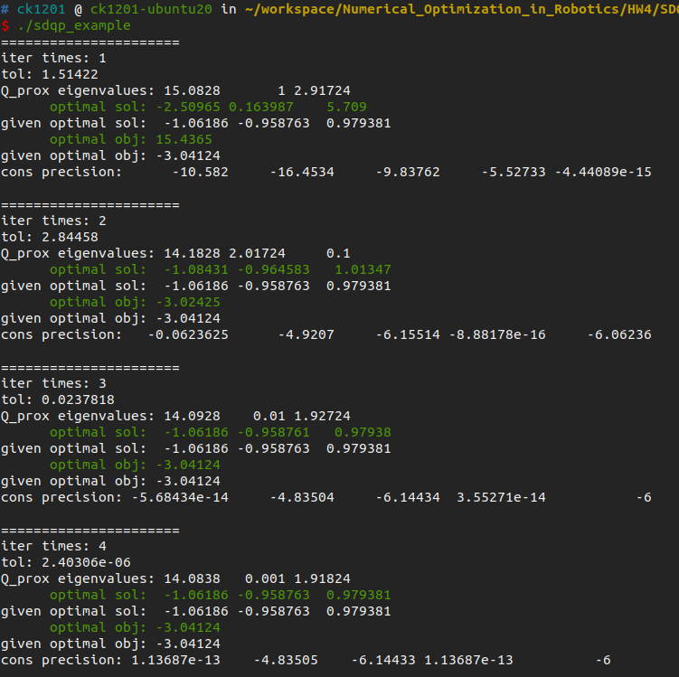
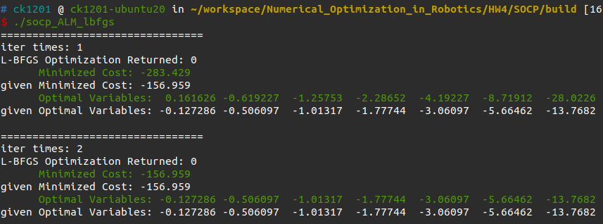
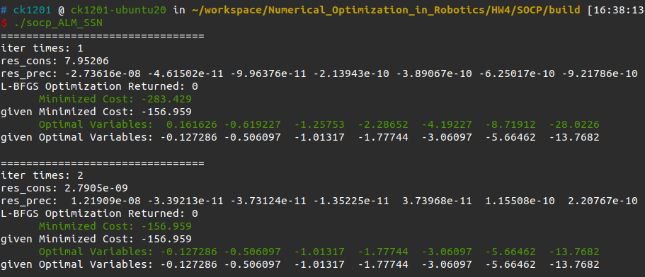

# Quick Start

## HW4_2

```
cd SDQP
mkdir build
cd build
cmake ..
make
./sdqp_example
```



## HW4_3

```
cd SOCP
mkdir build
cd build
cmake ..
make
./socp_ALM_lbfgs
./socp_ALM_SSN
```

LBFGS方法：



SSN方法：

