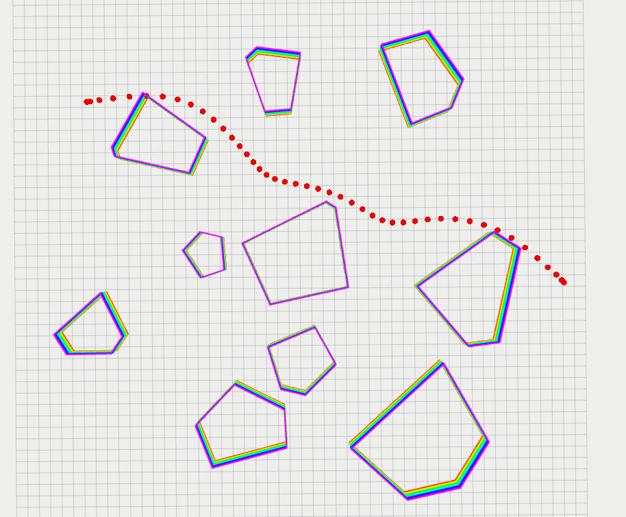
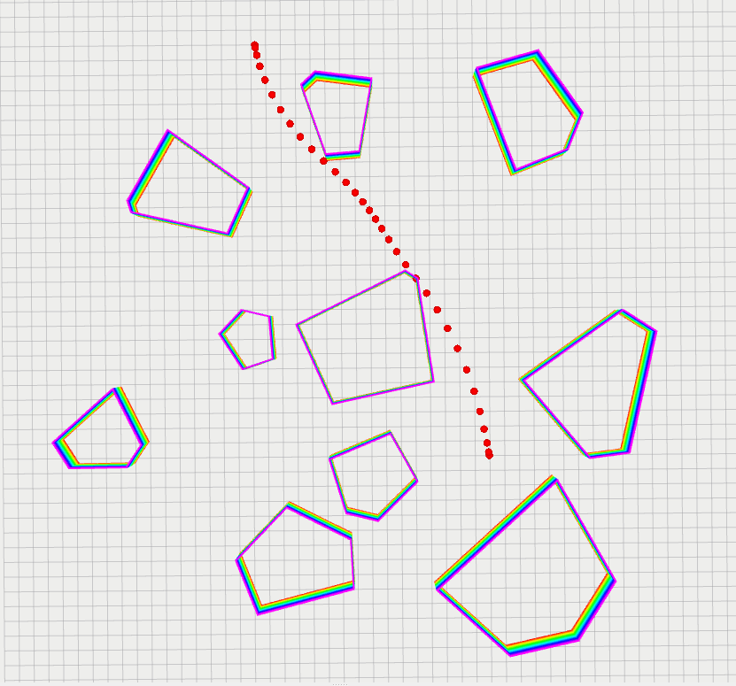
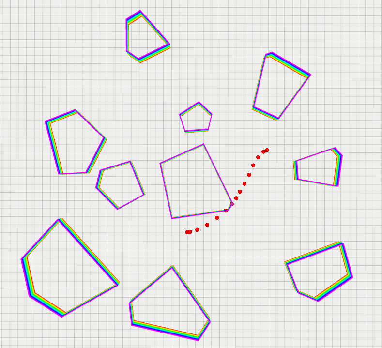
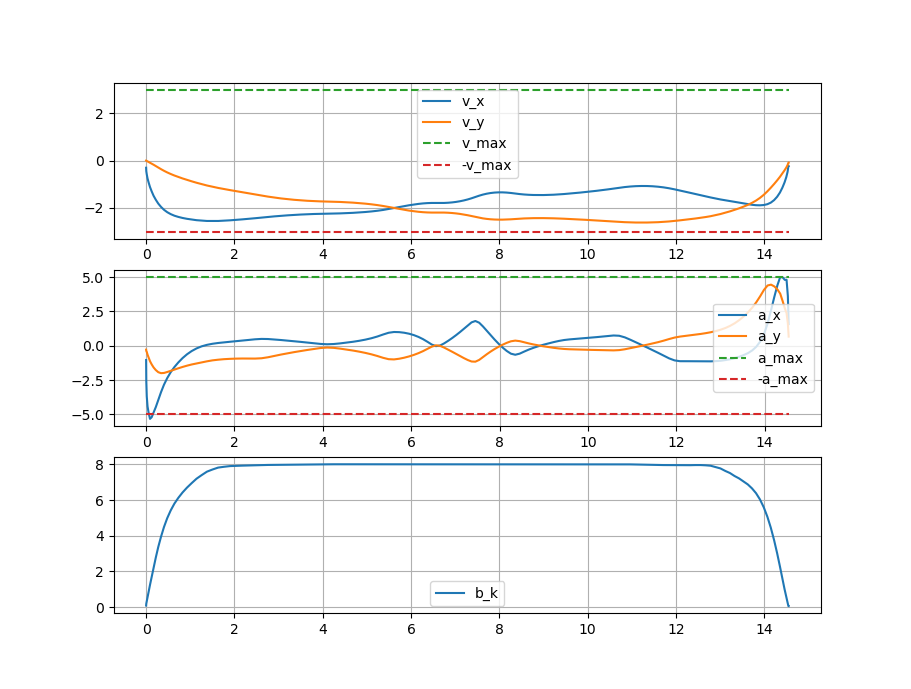
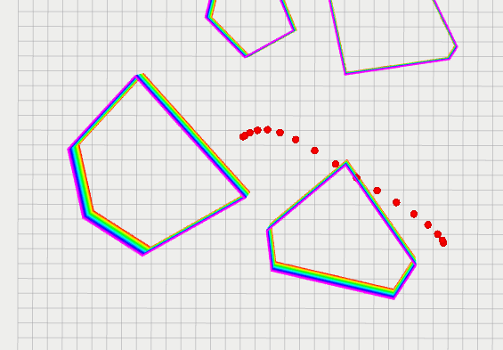
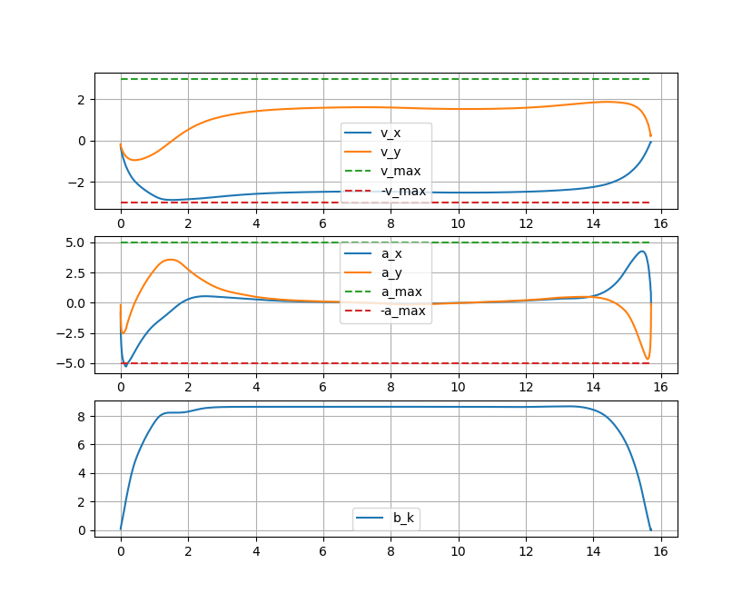

# HW5 Miscellaneous Techniques

## HW5_1 Traj Generation

### 1.1 Modeling

对于经过 $N+1$ 个给定点 $x_{0}, x_{1}, \ldots, x_{N}$ 的 $N$ 段轨迹 $p_{i}(s),i=0,\cdots,N$ ，每段轨迹都是一个三次样条曲线
$$
p_{i}(s)=a_{i}+b_{i} s+c_{i} s^{2}+d_{i} s^{3}, s \in[0,1],i=0,\cdots,N-1
$$
根据轨迹之间的一阶和二阶连续以及边界条件可得
$$
\begin{aligned}
&a_{i}=x_{i} \\
&b_{i}=D_{i} \\
&c_{i}=3\left(x_{i+1}-x_{i}\right)-2 D_{i}-D_{i+1} \\
&d_{i}=2\left(x_{i}-x_{i+1}\right)+D_{i}+D_{i+1}
\end{aligned},i=0,\cdots,N-1
$$
let $\mathbf{x}=[x_0,x_1,\cdots,x_{N-1},x_{N}]^{T}$ , then
$$
\mathbf{a}=
\left[\begin{array}{c}
a_{0} \\
\vdots \\
a_{N-1}
\end{array}\right]
=
\left[\begin{array}{ccccccc}
1 & & & & \\
 & 1 & & & \\
& & \ddots & & \\
& & & 1 & & \\
& & & & 1 & 0
\end{array}\right]_{N\times N+1}
\mathbf{x}
$$

$$
\mathbf{b}=
\left[\begin{array}{c}
b_{0} \\
\vdots \\
b_{N-1}
\end{array}\right]
=
\left[\begin{array}{ccccccc}
1 & & & & \\
 & 1 & & & \\
& & \ddots & & \\
& & & 1 & & \\
& & & & 1 & 0
\end{array}\right]_{N\times N+1}
\mathbf{D}
$$

$$
\mathbf{D}=
\left[\begin{array}{c}
D_{0} \\
\vdots \\
D_{N}
\end{array}\right]
=\mathbf{A}_D\mathbf{x}
$$

where,
$$
\mathbf{A}_D=3\left[\begin{array}{c}
\mathbf{0} \\
\mathbf{D}_D \\
\mathbf{0}
\end{array}\right]_{N+1\times N-1}
\left[\begin{array}{ccccccc}
-1 & 0 & 1 & & & & \\
 & -1 & 0 & 1 & & & \\
& & \ddots & \ddots & \ddots & & \\
& & & -1 & 0 & 1 & \\
& & & & -1 & 0 & 1
\end{array}\right]_{N-1\times N+1}
$$

$$
\mathbf{D}_D=\left[\begin{array}{ccccccc}
4 & 1 & & & & & \\
1 & 4 & 1 & & & & \\
& 1 & 4 & 1 & & & \\
& & 1 & 4 & 1 & & \\
& & & \ddots & \ddots & \ddots & \\
& & & & 1 & 4 & 1 \\
& & & & & 1 & 4
\end{array}\right]^{-1}_{N-1\times N-1}
$$

With respect to $\mathbf{c}$ ,
$$
\mathbf{c}=\left[\begin{array}{c}
c_{0} \\
\vdots \\
c_{N-1}
\end{array}\right]=
\mathbf{A}_c
\mathbf{x}
$$
Where,
$$
\mathbf{A}_c=
3
\left[\begin{array}{ccccccc}
-1 & 1 & & & & \\
& -1 & 1 & & & \\
& & \ddots & \ddots & & \\
& & & -1 & 1 & \\
& & & & -1 & 1
\end{array}\right]_{N\times N+1}
+
\left[\begin{array}{ccccccc}
-2 & -1 & & & & \\
& -2 & -1 & & & \\
& & \ddots & \ddots & & \\
& & & -2 & -1 & \\
& & & & -2 & -1
\end{array}\right]_{N\times N+1}\mathbf{A}_D
$$
With respect to $\mathbf{d}$ ,
$$
\mathbf{d}=\left[\begin{array}{c}
d_{0} \\
\vdots \\
d_{N-1}
\end{array}\right]=
\mathbf{A}_d\mathbf{x}
$$
Where,
$$
\mathbf{A}_d=
2
\left[\begin{array}{ccccccc}
1 & -1 & & & & \\
& 1 & -1 & & & \\
& & \ddots & \ddots & & \\
& & & 1 & -1 & \\
& & & & 1 & -1
\end{array}\right]_{N\times N+1}+
\left[\begin{array}{ccccccc}
1 & 1 & & & & \\
& 1 & 1 & & & \\
& & \ddots & \ddots & & \\
& & & 1 & 1 & \\
& & & & 1 & 1
\end{array}\right]_{N\times N+1}\mathbf{A}_D
$$

#### 1.1.1 Stretch Energy

$$
\operatorname{Energy}\left(x_{1}, x_{2}, \ldots, x_{N-1}\right)=\sum_{i=0}^{N-1} \int_{0}^{1}\left\|p_{i}^{(2)}(s)\right\|^{2} \mathrm{~d} s
$$

Where,

$p_{i}^{(2)}(s)=2c_i+6d_is$

$\left\|p_{i}^{(2)}(s)\right\|=4c_{i}^2+24c_{i}d_{i}s+36d_{i}^2s^2$

$E_	i=\int_{0}^{1}\left\|p_{i}^{(2)}(s)\right\|^{2} \mathrm{~d} s=4c_{i}^2+12c_{i}d_{i}+12d_{i}^2$

then
$$
\mathbf{E}=4\mathbf{c}^T\mathbf{c}+12(\mathbf{c}^T\mathbf{d}+\mathbf{d}^T\mathbf{d})
=\mathbf{x}^T(4\mathbf{A}_c^T\mathbf{A}_c+12\mathbf{A}_c^T\mathbf{A}_d+12\mathbf{A}_d^T\mathbf{A}_d)\mathbf{x}
=\mathbf{x}^T\mathbf{A}_E\mathbf{x}
$$
whose gradient is
$$
\frac{\partial \mathbf{E}}{\partial \mathbf{x}}=(\mathbf{A}_E+\mathbf{A}_E^T)\mathbf{x}
$$

When it comes to two-dimensional case, let $\mathbf{x}=[x_0,\cdots,x_{N},y_0,\cdots,y_{N}]^{T}_{\ 2(N+1)\times1}$ , then
$$
\mathbf{E}=\mathbf{x}^T\mathbf{A}_E^{'}\mathbf{x}=\mathbf{x}^T\left[\begin{array}{ccccccc}
\mathbf{A}_E & \\
& \mathbf{A}_E \\
\end{array}\right]_{2(N+1)\times 2(N+1)}\mathbf{x}
$$

$$
\frac{\partial \mathbf{E}}{\partial \mathbf{x}}=\left[\begin{array}{ccccccc}
\mathbf{A}_E+\mathbf{A}_E^T & \\
& \mathbf{A}_E+\mathbf{A}_E^T \\
\end{array}\right]_{2(N+1)\times 2(N+1)}\mathbf{x}
$$

#### 1.1.2 Potential

$$
\operatorname{Potential}\left(x_{1}, x_{2} \ldots, x_{N-1}\right)=1000 \sum_{i=1}^{N-1} \sum_{j=1}^{M}d_{i,j}
$$

Where,
$$
d_{i,j}= \begin{cases}min(d_{s,i,1},\cdots,d_{s,i,s_j}) & ,\text { if } A_{\mathcal{P},j} x_i \leq b_{\mathcal{P},j} \\ 0 & ,\text { otherwise }\end{cases}
$$
is the distance between $x_i$ and the k-th segment of obstacle j.

**Smoothing**

对 $-max(-d_{s,i,1},\cdots,-d_{s,i,s_j})$ 使用 LSE 光滑化，则
$$
d_{i,j}= \begin{cases}-\epsilon \ln (\sum_{k=1}^{s_j} e^{-d_{s,i,k}/\epsilon}) & ,\text { if } A_{\mathcal{P},j} x_i \leq b_{\mathcal{P},j} \\ 0 & ,\text { otherwise }\end{cases}
$$
Potential 的梯度为

$$
\frac{\partial P}{\partial x}=
1000\left[\begin{array}{c}
\sum_{j=1}^{M}g_{1,j} \\
\vdots \\
\sum_{j=1}^{M}g_{N-1,j}
\end{array}\right]
$$
Where,
$$
g_{i,j}= \begin{cases}\frac{1}{\sum_{k=1}^{s_j} e^{-d_{s,i,k}/\epsilon}}\sum_{k=1}^{s_j} e^{-d_{s,i,k}/\epsilon}\frac{x_i-o_{i,j,k}}{\left\|x_{i}-o_{i,j,k}\right\|} & ,\text { if } A_{\mathcal{P},j} x_i \leq b_{\mathcal{P},j} \\ 0 & ,\text { otherwise }\end{cases}
$$

where $o_{i,j}$ is the closest point to $x_i$ on $A_{\mathcal{P},j} x_i = b_{\mathcal{P},j}$ 。use LBFGS to solve this problem。

### 1.2 Result

## HW5_2 TOPP

The trajectory produced from HW5_1 is

$$
\begin{aligned}
&x_i(p)=a_{x,i}+b_{x,i}p+c_{x,i}p^2+d_{x,i}p^2\\
&y_i(p)=a_{y,i}+b_{y,i}p+c_{y,i}p^2+d_{y,i}p^2\\
\end{aligned}
\ \ \ i=1,\cdots,N,\ p\in[0,1]
$$
set the step as $d_p$ , assume that the trajectory between two points is a straight line. Then the arc length of the trajectory is
$$
s_k=\sum_{m=0}^{n_k-1}\sqrt{(x((m+1)d_p)-x(md_p))^2+(y(x((m+1)d_p)-y(md_p))^2}, \ \ 0 \leq k \leq K
$$

The derivative of arc length w.r.t arc length is
$$
q_m^{\prime}(s^{k})=
\begin{cases}
\frac{q_m(s^{k+1})-q_m(s^{k})}{s_{k+1}-s_{k}} & ,k=0 \\ 
\frac{q_m(s^{k+1})-q_m(s^{k-1})}{s_{k+1}-s_{k-1}} & ,1 \leq k \leq K-1 \\ 
\frac{q_m(s^{k})-q_m(s^{k-1})}{s_{k}-s_{k-1}} & ,k=K
\end{cases}, \ \ m=x,y
$$
second order derivative:
$$
q_m^{\prime\prime}(s^{k})=
\begin{cases}
\frac{q_m^{\prime}(s^{k+1})-q_m^{\prime}(s^{k})}{s_{k+1}-s_{k}} & ,k=0 \\ 
\frac{q_m^{\prime}(s^{k+1})-q_m^{\prime}(s^{k-1})}{s_{k+1}-s_{k-1}} & ,1 \leq k \leq K-1 \\
\frac{q_m^{\prime}(s^{k})-q_m^{\prime}(s^{k-1})}{s_{k}-s_{k-1}} & ,k=K
\end{cases} \ \ m=x,y
$$

### 2.1 Formulate

$$
\begin{array}{lll}
\underset{a^{k}, b^{k}, c^{k}, d^{k}}{\min}  & \sum_{k=0}^{K-1} 2\left(s^{k+1}-s^{k}\right) d^{k} & \\
\text { s.t. } & 
\left\|\begin{array}{c}
2 \\
c^{k+1}+c^{k}-d^{k}
\end{array}\right\| 
\leq c^{k+1}+c^{k}+d^{k}, & 0 \leq k \leq K-1 \\
&\left\|\begin{array}{c}
2 c^{k} \\
b^{k}-1
\end{array}\right\| \leq b^{k}+1, & 0 \leq k \leq K\\

&b^{k} \geq 0, & 0 \leq k \leq K \\
&b^{k+1}-b^{k}=2\left(s^{k+1}-s^{k}\right) a^{k}, & 0 \leq k \leq K-1 \\
&\left\|q^{\prime}(s^{k})\sqrt{b^{k}}\right\|_{\infty} \leq v_{\max }, & 0 \leq k \leq K \\
&\left\|q^{\prime \prime}\left(s^{k}\right) b^{k}+q^{\prime}\left(s^{k}\right) a^{k}\right\|_{\infty} \leq a_{\max }, & 0 \leq k \leq K-1 \\
&b^0=b_{0}, b^K=b_{K} . &
\end{array}
$$

Let 
$$
\begin{aligned}
\boldsymbol{x}&=[a_0,\cdots,a_{K-1},b_0,\cdots,b_{K},c_0,\cdots,c_{K},d_0,\cdots,d_{K-1}]^T \\
\boldsymbol{s}&=[s_0,\cdots,s_{K}]^T
\end{aligned}
$$

Then, 
$$
\left[\begin{array}{c}
s_{1}-s_{0} \\
\vdots \\
s_{K}-s_{K-1}
\end{array}\right]
=
\left[\begin{array}{ccccccc}
-1 & 1 & & & & \\
& -1 & 1 & & & \\
& & \ddots & \ddots & & \\
& & & -1 & 1 & \\
& & & & -1 & 1
\end{array}\right]_{K\times K+1}
\boldsymbol{s}=\pmb{A}_d\boldsymbol{s}
$$

#### 2.1.1 Object function

$$
\boldsymbol{f}^T\boldsymbol{x}
$$

$$
\boldsymbol{f}=2\ 
[\pmb{0}_{K\times K} \ \ \pmb{0}_{K\times K+1} \ \  \pmb{0}_{K\times K+1} \ \  \pmb{I}_{K\times K}]^T\pmb{A}_d\boldsymbol{s}
$$

#### 2.1.2 Inequality constraint

for the first inequality constraint
$$
\left\|\begin{array}{c}
2 \\
c^{k+1}+c^{k}-d^{k}
\end{array} \right\|_{2}
 \leq c^{k+1}+c^{k}+d^{k},\ \  0 \leq k \leq K-1
$$
Let 
$$
\pmb{A}_{1,k}\boldsymbol{x}+\boldsymbol{b}_{1,k}=
\left[\begin{array}{ccccccc}
\pmb{0}_{2K+1+k} & 1 & 1 & \pmb{0}_{K-1} & 1 & \pmb{0}_{K-k-1} \\
& & \pmb{0} & \pmb{0} & & \\
\pmb{0}_{2K+1+k} & 1 & 1 & \pmb{0}_{K-1} & -1 & \pmb{0}_{K-k-1}
\end{array}\right]\boldsymbol{x}+
\left[\begin{array}{c}
0 \\
2 \\
0
\end{array}\right]
\in \mathcal{Q}^{3}, \ \ 0 \leq k \leq K-1
$$

Similarly, for the second inequality constraint
$$
\pmb{A}_{2,k}\boldsymbol{x}+\boldsymbol{b}_{2,k}=
\left[\begin{array}{ccccccc}
\pmb{0}_{K+k} & 1 & \pmb{0}_{3K-k+1} \\
\pmb{0}_{2K+k+1} & 2 & \pmb{0}_{2K-k} \\
\pmb{0}_{K+k} & 1 & \pmb{0}_{3K-k+1} 
\end{array}\right]\boldsymbol{x}+
\left[\begin{array}{c}
1 \\
0 \\
-1
\end{array}\right]
\in \mathcal{Q}^{3}, \ \ 0 \leq k \leq K
$$
for the third inequality constraint
$$
\pmb{A}_{3,k}\boldsymbol{x}+\boldsymbol{b}_{3,k}=
\left[\begin{array}{ccccccc}
\pmb{0}_{K+k}& 1 & \pmb{0}_{3K-k+1}
\end{array}\right]\boldsymbol{x}+
\left[\begin{array}{ccccccc}
0
\end{array}\right]
\in \mathcal{Q}^{1}, \ \ 0 \leq k \leq K
$$

for the fourth inequality constraint
$$
\pmb{A}_{4,1,k}\boldsymbol{x}+\boldsymbol{b}_{4,1,k}=
\left[\begin{array}{ccccccc}
\pmb{0}_{K+k}& -q_x^{\prime2}\left(s^{k}\right) & \pmb{0}_{3K-k+1}
\end{array}\right]\boldsymbol{x}+
\left[\begin{array}{ccccccc}
v_{max}
\end{array}\right]
\in \mathcal{Q}^{1}, \ \ 0 \leq k \leq K
$$

$$
\pmb{A}_{4,2,k}\boldsymbol{x}+\boldsymbol{b}_{4,2,k}=
\left[\begin{array}{ccccccc}
\pmb{0}_{K+k}& -q_y^{\prime2}\left(s^{k}\right) & \pmb{0}_{3K-k+1}
\end{array}\right]\boldsymbol{x}+
\left[\begin{array}{ccccccc}
v_{max}
\end{array}\right]
\in \mathcal{Q}^{1}, \ \ 0 \leq k \leq K
$$

$$
\pmb{A}_{4,3,k}\boldsymbol{x}+\boldsymbol{b}_{4,3,k}=
\left[\begin{array}{ccccccc}
\pmb{0}_{K+k}& q_x^{\prime2}\left(s^{k}\right) & \pmb{0}_{3K-k+1}
\end{array}\right]\boldsymbol{x}+
\left[\begin{array}{ccccccc}
v_{max}\\
\end{array}\right]
\in \mathcal{Q}^{1}, \ \ 0 \leq k \leq K
$$

$$
\pmb{A}_{4,4,k}\boldsymbol{x}+\boldsymbol{b}_{4,4,k}=
\left[\begin{array}{ccccccc}
\pmb{0}_{K+k}& q_y^{\prime2}\left(s^{k}\right) & \pmb{0}_{3K-k+1}
\end{array}\right]\boldsymbol{x}+
\left[\begin{array}{ccccccc}
v_{max}\\
\end{array}\right]
\in \mathcal{Q}^{1}, \ \ 0 \leq k \leq K
$$

for the fifth inequality constraint

$$
\pmb{A}_{5,1,k}\boldsymbol{x}+\boldsymbol{b}_{5,1,k}=
\left[\begin{array}{ccccccc}
\pmb{0}_{k} & q_x^{\prime}\left(s^{k}\right) & \pmb{0}_{K-1} & q_x^{\prime \prime}\left(s^{k}\right) & \pmb{0}_{3K-k+1}
\end{array}\right]\boldsymbol{x}+
\left[\begin{array}{ccccccc}
a_{max}
\end{array}\right]
\in \mathcal{Q}^{1}, \ \ 0 \leq k \leq K-1
$$

$$
\pmb{A}_{5,2,k}\boldsymbol{x}+\boldsymbol{b}_{5,2,k}=
\left[\begin{array}{ccccccc}
\pmb{0}_{k} & q_y^{\prime}\left(s^{k}\right) & \pmb{0}_{K-1} & q_y^{\prime \prime}\left(s^{k}\right) & \pmb{0}_{3K-k+1}
\end{array}\right]\boldsymbol{x}+
\left[\begin{array}{ccccccc}
a_{max}\\
\end{array}\right]
\in \mathcal{Q}^{1}, \ \ 0 \leq k \leq K-1
$$

$$
\pmb{A}_{5,3,k}\boldsymbol{x}+\boldsymbol{b}_{5,3,k}=
\left[\begin{array}{ccccccc}
\pmb{0}_{k} & -q_x^{\prime}\left(s^{k}\right) & \pmb{0}_{K-1} & -q_x^{\prime \prime}\left(s^{k}\right) & \pmb{0}_{3K-k+1}
\end{array}\right]\boldsymbol{x}+
\left[\begin{array}{ccccccc}
a_{max}
\end{array}\right]
\in \mathcal{Q}^{1}, \ \ 0 \leq k \leq K-1
$$

$$
\pmb{A}_{5,4,k}\boldsymbol{x}+\boldsymbol{b}_{5,4,k}=
\left[\begin{array}{ccccccc}
\pmb{0}_{k} & -q_y^{\prime}\left(s^{k}\right) & \pmb{0}_{K-1} & -q_y^{\prime \prime}\left(s^{k}\right) & \pmb{0}_{3K-k+1}
\end{array}\right]\boldsymbol{x}+
\left[\begin{array}{ccccccc}
a_{max}
\end{array}\right]
\in \mathcal{Q}^{1}, \ \ 0 \leq k \leq K-1
$$

#### 2.1.3 Equality constraint

rewrite $b^{k+1}-b^{k}=2\left(s^{k+1}-s^{k}\right) a^{k}, \ 0 \leq k \leq K-1$ 
$$
\pmb{A}_d[\pmb{0} \ \ \pmb{I} \ \  \pmb{0} \ \  \pmb{0}]_{K+1\times4K+2}\boldsymbol{x}=2diag(\pmb{A}_d\boldsymbol{s})[\pmb{I} \ \ \pmb{0} \ \  \pmb{0} \ \  \pmb{0}]_{K\times4K+2}\boldsymbol{x}
$$
all Equality constraints can be written as follow
$$
\left[\begin{array}{c}
\pmb{A}_d[\pmb{0} \ \ \pmb{I} \ \  \pmb{0} \ \  \pmb{0}]_{K+1\times4K+2}-2diag(\pmb{A}_d\boldsymbol{s})[\pmb{I} \ \ \pmb{0} \ \  \pmb{0} \ \  \pmb{0}]_{K\times4K+2} \\
[\pmb{0}_K \ \ 1 \ \  \pmb{0}_{3K+1}] \\
[\pmb{0}_{2K} \ \ 1 \ \  \pmb{0}_{2K+1}]
\end{array}\right]\boldsymbol{x}
=
\pmb{G}\boldsymbol{x}
=
\left[\begin{array}{c}
\boldsymbol{0} \\
b_{0} \\
b_{K}
\end{array}\right]=\boldsymbol{h}
$$
where $\pmb{0}$ and $\pmb{I}$ are zero matrix and identity matrix with appropriate size.

#### 2.1.4 Conic ALM

AL:
$$
\mathcal{L}_{\rho}(\boldsymbol{x},\boldsymbol{\lambda}, \boldsymbol{\mu})=\boldsymbol{f}^T\boldsymbol{x}+\frac{\rho}{2}\left(\left\|\pmb{G}\boldsymbol{x}-\boldsymbol{h}+\frac{\boldsymbol{\lambda}}{\rho}\right\|+\sum_{i=1}^{12K+6}\left\|\pmb{P}_{\mathcal{K}_i}\left(\frac{\boldsymbol{\mu}_i}{\rho}-\pmb{A}_i x-\boldsymbol{b}_i\right)\right\|^{2}\right)
$$
whose gradient is
$$
\nabla_x \mathcal{L}_{\rho}(\boldsymbol{x}, \boldsymbol{\lambda}, \boldsymbol{\mu})=\boldsymbol{f}+\pmb{G}^T(\boldsymbol{\lambda}+\rho(\pmb{G}\boldsymbol{x}-\boldsymbol{h}))-\sum_{i=1}^{12K+6}\pmb{A}_i^T \pmb{P}_{\mathcal{K}_i}\left(\boldsymbol{\mu}-\rho(\pmb{A}_i \boldsymbol{x}+\boldsymbol{b}_i)\right)
$$

Where,
$$
P_{\mathcal{K}=\mathcal{Q}^n}(v)= \begin{cases}0, & v_0 \leq-\left\|v_1\right\|_2 \\ \frac{v_0+\left\|v_1\right\|_2}{2\left\|v_1\right\|_2}\left(\left\|v_1\right\|_2, v_1\right)^{\mathrm{T}}, & \left|v_0\right|<\left\|v_1\right\|_2 \\ v, & v_0 \geq\left\|v_1\right\|_2\end{cases},\ \ n\geq 2
$$

$$
P_{\mathcal{K}=\mathcal{Q}^n}(v)= 
\begin{cases}
0, & v \leq0 \\ 
v, & v\geq0
\end{cases},\ \ n= 1
$$

### 2.2 Result

case 1

case 2

